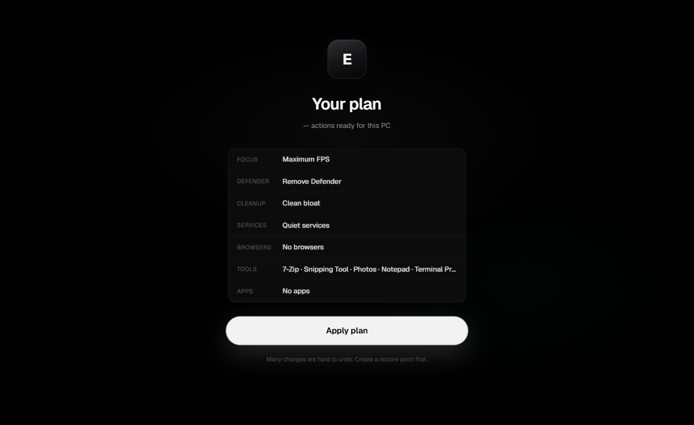

# Exo OS

**Built quiet. Tuned sharp.**

Exo OS turns a stock Windows 11 install into a **gaming-first system** — lower background noise, cleaner input path, honest options — through one calm app. No account. No ads. Open playbook you can read.

[](https://github.com/ImAvgErix/ExoOS/releases/latest)
[](LICENSE)
[](https://github.com/ImAvgErix/ExoOS/releases/latest)
[](https://dotnet.microsoft.com/)

<p align="center">
  <a href="https://github.com/ImAvgErix/ExoOS/releases/latest"><strong>Download Exo OS</strong></a>
  &nbsp;·&nbsp;
  <a href="CHANGELOG.md">Changelog</a>
  &nbsp;·&nbsp;
  <a href="docs/SHIP.md">Ship</a>
  &nbsp;·&nbsp;
  <a href="docs/ARCHITECTURE.md">Architecture</a>
</p>

<br />

<p align="center">
  
</p>

<p align="center">
  
</p>

<p align="center">
  
</p>

---

## What it is

A **local Windows transform** for people who care about FPS, stutter, and quiet systems — without living in Registry Editor.

You answer a short setup. Exo OS builds a plan. One **Apply**. Reboot when you can.

| | |
| --- | --- |
| **Open** | Full YAML playbook + scripts — audit, fork, or dry-run from the CLI |
| **Calm UI** | AMOLED shell — true black, Geist, white pill CTA · fixed 1400×900 |
| **Two modes** | **Balanced** (safe ceiling) or **Extreme** (barebones gaming strip) |
| **Honest** | Anti-cheat / Defender / DRM constraints documented — no vaporware |

---

## Two modes

| | **Balanced** | **Extreme** (Maximum FPS) |
| --- | --- | --- |
| **For** | Daily gaming PC that still feels normal | Barebones essentials — games, browsers you pick, Store, Discord-class apps |
| **Strip depth** | Highest *safe* ceiling + shared gaming baseline | Deep services, DISM, VBS, Edge strip, max quiet |
| **Edge** | Kept (unless cleanup opts in) | Removed as forced Windows bloat |
| **Browsers in setup** | Brave · Helium · Zen · LibreWolf | Same — no Chrome in the UI |

---

## Install

**Needs:** Windows 11 x64 · **Administrator** for apply · WebView2

1. Download **`ExoOS.exe`** from [Releases](https://github.com/ImAvgErix/ExoOS/releases/latest)  
2. Run the installer — installs under your user profile, Start menu entry, then launches  
3. Complete setup → **Apply plan** (Administrator when prompted)  
4. Reboot when convenient  

Builds are unsigned; SmartScreen may warn. Use official GitHub releases only.

```powershell
.\scripts\Publish-ExoOS.ps1   # from source
```

---
## Safety

- Restore point or full image first  
- Stay on AC power for long applies  
- Many changes are hard to reverse without reinstall  
- CLI dry-run: `ExoForge.Cli apply playbooks\exoos --dry-run` · live: `--live`  
- Removing Defender can affect anti-cheat and security  

---

## Family

| Product | Role |
| --- | --- |
| **[Exo](https://github.com/ImAvgErix/Exo)** | Per-module gaming optimizers |
| **[Exo OS](https://github.com/ImAvgErix/ExoOS)** | Windows transform (this repo) |
| **[Exocord](https://github.com/ImAvgErix/Exocord)** | Native desktop chat & voice |
| **[Exo Launcher](https://github.com/ImAvgErix/ExoLauncher)** | One library UI; store clients as invisible backends |

---

## License & privacy

MIT © 2026 Erix ([ImAvgErix](https://github.com/ImAvgErix)) — [LICENSE](LICENSE) · [PRIVACY.md](PRIVACY.md) · [SECURITY.md](SECURITY.md)

<p align="center"><sub>Built quiet. Tuned sharp.</sub></p>

