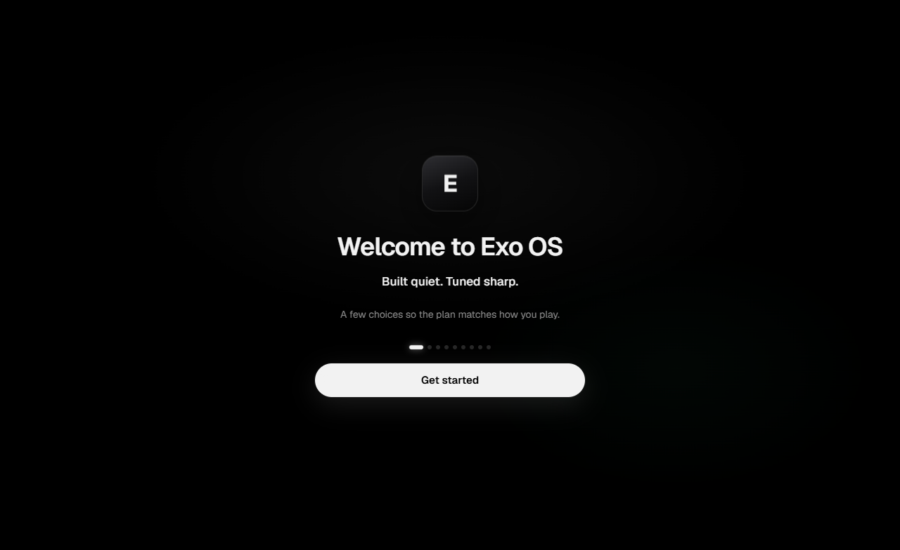
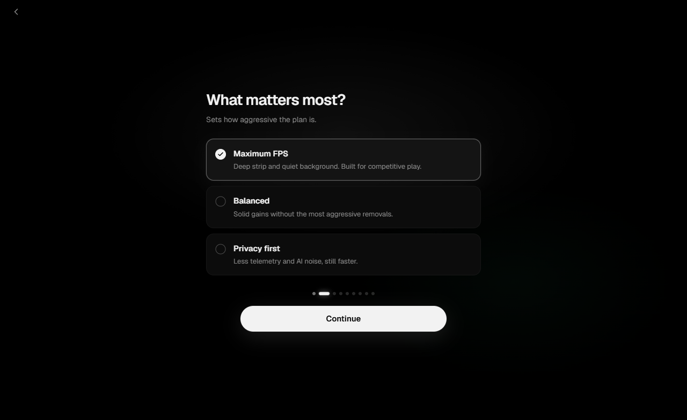

# Exo OS

  

**Presence without weight.**

Exo OS turns a stock **Windows 11** install into a **pure gaming OS** — Maximum FPS, lowest RAM/startup/process count, lowest input & network latency, best privacy. One calm app. No account. No ads.

  <a href="https://github.com/ImAvgErix/ExoOS/releases/latest"><strong>Download Exo OS</strong></a>

  

## What it does for you

| | |
| --- | --- |
| **More FPS, less stutter** | Ultimate audited strip — registry, tasks, services, AppX, DISM, NIC/audio/USB latency packs |
| **Extreme by default** | **Maximum FPS** barebones gaming OS · dial back to **Balanced** only if you need more of Windows |
| **Hardware latency** | Mouse/keyboard 1:1, monitor VRR/HAGS/AutoHDR, mic/audio exclusive, NIC interrupt moderation |
| **One plan, one Apply** | Short setup → a plan you can read → apply when ready → reboot when convenient |
| **Honest limits** | Anti-cheat, Defender, and DRM constraints are called out — no vaporware |

  

## How you use it

1. Download the latest **zip** from [Releases](https://github.com/ImAvgErix/ExoOS/releases/latest)  
2. Extract and run **ExoOS.exe** as Administrator  
3. Walk through setup → **Apply** → reboot when you can  

Prefer a restore point. Extreme is the default strip. Windows 11 x64.

## Privacy

Local tool. No account required — see [PRIVACY.md](PRIVACY.md).

## Family

| Product | Role |
| --- | --- |
| **[Exo Hub](https://github.com/ImAvgErix/ExoHub)** | Gaming optimizers |
| **[Exo OS](https://github.com/ImAvgErix/ExoOS)** | Windows gaming transform |
| **[Exo Link](https://github.com/ImAvgErix/ExoLink)** | Desktop chat & voice |
| **[Exo Launcher](https://github.com/ImAvgErix/ExoLauncher)** | Game library |

---
## License

MIT © 2026 Erix ([ImAvgErix](https://github.com/ImAvgErix))

Presence without weight.

